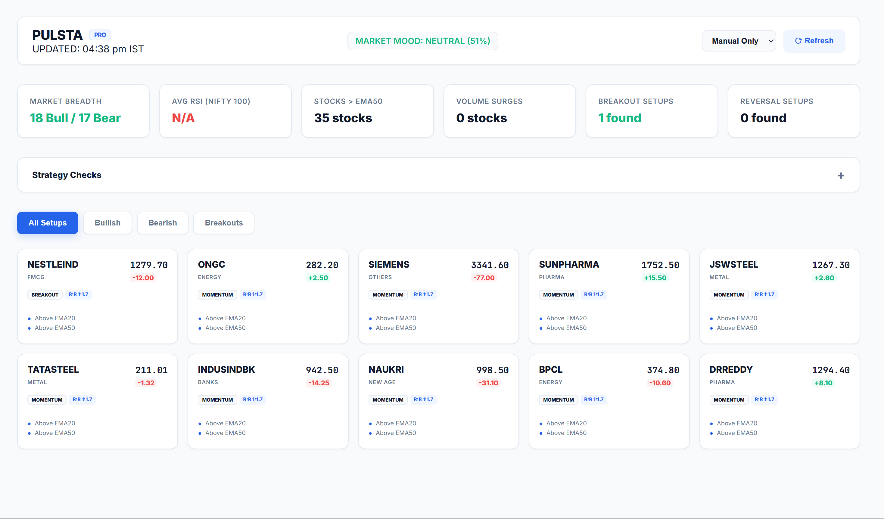

# PULSTA — Advanced Daily Market Analysis Terminal

PULSTA is a high-performance market analysis terminal that integrates Zerodha's Kite API with an automated technical analysis pipeline to identify high-probability trade setups (Breakouts & Momentum).

## 🚀 Key Features
- **Automated Pipeline:** Syncs historical data, runs algorithmic strategy checks, and generates detailed setup reports.
- **SaaS-Style Dashboard:** Modern, light-themed web interface with a compact grid layout.
- **Interactive Modals:** Detailed trade plans including Recommended Entry, Stop Loss, and multiple Targets.
- **Collapsible Strategy Panel:** Real-time monitoring of swing and intraday signals for your entire watchlist.
- **Period Trigger:** Built-in auto-refresh mechanism (5m to 60m intervals) for continuous monitoring.

## 🛠️ Tech Stack
- **Backend:** Node.js, Express
- **Analysis:** Custom technical scoring engine (RSI, EMA, ATR, Volume Profile)
- **Frontend:** Vanilla JS, CSS (SaaS Light Theme)
- **Data Source:** Zerodha Kite API (MCP Server recommended)

## 📦 Installation

1. **Clone the repository:**
   ```bash
   git clone https://github.com/yourusername/pulsta.git
   cd pulsta
   ```

2. **Install dependencies:**
   ```bash
   npm install
   ```

3. **Configure Environment:**
   Create a `.env` file based on `.env.example`:
   ```bash
   PORT=3002
   # Add your Kite API keys if using standard SDK
   ```

## 🔄 Running the Analysis

The analysis requires two stages of data: **Live Quotes** and **Historical OHLCV**.

1. **Fetch & Process Data:**
   Use the utility scripts or your preferred Kite MCP tools to populate `quotes_temp.json` and `history_temp.json`.

2. **Run the Main Pipeline:**
   ```bash
   node main-analysis.js
   ```
   This script will:
   - Sync history to the `histdata/` folder.
   - Execute `strategy-checks.js` to identify specific patterns.
   - Run `analyse.js` to generate the final `data/setups.json` report.

## 💻 Starting the Dashboard

```bash
node server.js
```
- Open `http://localhost:3002` in your browser.
- Set your preferred **Auto-Refresh** interval in the header to keep the data live.

## 📂 Project Structure
- `analyse.js`: The core scoring and R:R calculation engine.
- `main-analysis.js`: Orchestrates the full data-to-report pipeline.
- `strategy-checks.js`: Scans for specific algorithmic signals (e.g., PrevHighBreak).
- `public/`: Frontend assets (Dashboard UI).
- `data/`: Processed JSON results used by the terminal.
- `histdata/`: Local storage for symbol-wise historical candles.

---
*Disclaimer: This tool is for informational purposes only. Always validate setups with your own analysis before trading.*
